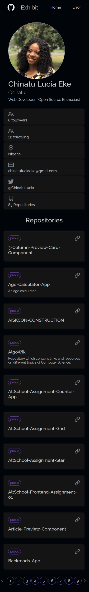
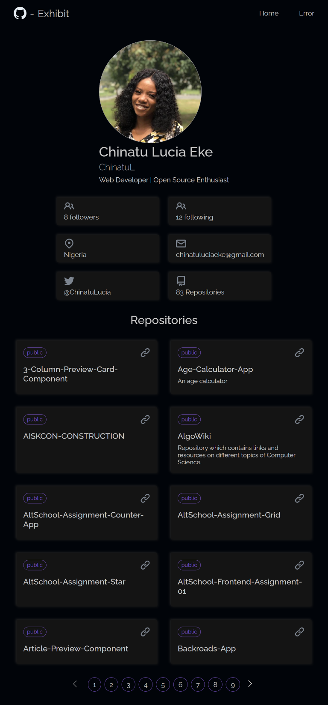

# Git-Exhibit

Git Exhibit is a webapp that implements a Github API fetch of a users portfolio, displays details from the users profile, a list of all public repositories and a link to details of each repository

## Features
- Home Page with profile details and repositories list
- Repo page displaying information about a single repository
- Pagination
- Custom Error Page
- Error Test Page

## Screenshots
- Mobile view

- Tablet view

- Desktop veiw

## Built with
- React
- Vite
- Css

## Libraries used
- react-error-boundary
- react-helmet-async
- react-router-dom

## Live Site
A live version of Git-Exhibit can be found at [https://git-exhibit-webapp.netlify.app/](https://git-exhibit-webapp.netlify.app/)

